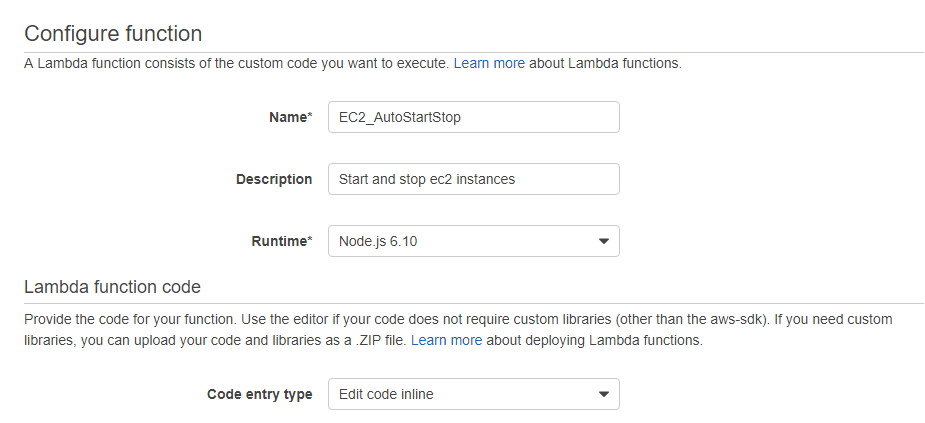
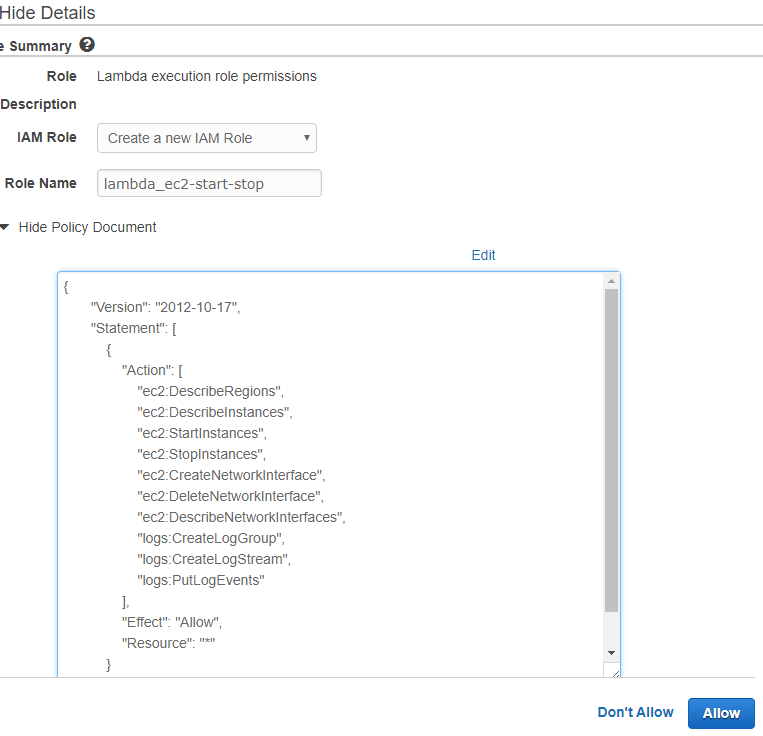
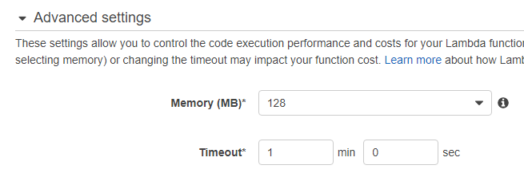
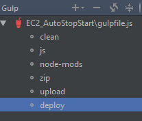
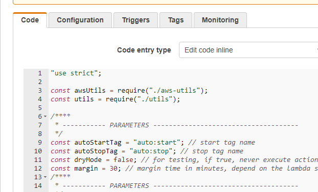
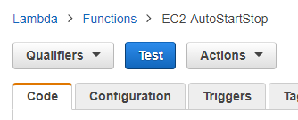

# EC2-AutoStopAndStart

:heavy_dollar_sign::heavy_dollar_sign: SAVE YOUR MONEY :heavy_dollar_sign::heavy_dollar_sign:

You can save your money by starting EC2 instances only when you really need it.
This for a negligible amount, less than $1 a year, needed for the small AWS Lambda.
This Node.js application give you the ability to auto stop and start EC2 instances which are tagged with `auto:stop` and `auto:start`.

Inspired by existing python and nodejs applications. In particular this one : https://schen1628.wordpress.com/2014/02/04/auto-start-and-stop-your-ec2-instances/

## Main dependencies

* cron-parser: https://www.npmjs.com/package/cron-parser
* aws-sdk: https://www.npmjs.com/package/aws-sdk
* node-aws-lambda: https://github.com/ThoughtWorksStudios/node-aws-lambda

## Examples:

  * Auto-stop instance every day at 7pm : `0 19 * * *`
  * Auto-start instance every day at 8:30am : `0 30 8 * * *`

With a default margin of 15 minutes, EC2 instances will be stopped between 6:45 and 7pm and started between 8am and 8:15am.
The margin time can be set with a variable.

Values of tags are CRON expressions : http://www.cronmaker.com/. Seconds are optionals.

**Never forget that AWS Lambda works with UTC Time.**
    
## AWS Lambda Configuration

create a lambda with the AWS console (https://eu-west-1.console.aws.amazon.com/lambda/):

* Choose "Blank function" blueprint
* Configure a trigger:
   * choose CloudWatch Events
   * create a new rule, give it a significant name and description
   * choose rule type: "Schedule expression"
   * insert a schedule expression: rate(5 minutes) or what you need...
   * click "Enable trigger" now or later if you need test


* Click "Next"
* Configure function : give a name and a description for the lambda
* Runtime: choose Node,js 6.10
* Lambda function code: let "Edit code inline"



* Lambda function handler and role:

    * Handler: let "index.handler"
    * Role: choose "create a custom role":
    * In the opened page, choose "Create a new IAM role"
    * Give it a name
    * Click **View policy document**
    * Click on the **Edit** button, confirm, and paste this policy:

    ```json
   {
       "Version": "2012-10-17",
       "Statement": [
           {
               "Action": [
                   "ec2:DescribeRegions",
                   "ec2:DescribeInstances",
                   "ec2:StartInstances",
                   "ec2:StopInstances",
                   "ec2:CreateNetworkInterface",
                   "ec2:DeleteNetworkInterface",
                   "ec2:DescribeNetworkInterfaces",
                   "logs:CreateLogGroup",
                   "logs:CreateLogStream",
                   "logs:PutLogEvents"
               ],
               "Effect": "Allow",
               "Resource": "*"
           }
       ]
   }
   ```
    * Don't forget to click on the **Allow**

    

 * Advanced settings:

    * let the default memory configuration (128Mo)
    * **Adjust the time-out to 1 minute**

    

    * If you have a specific VPC configuration, you can set it:

    

* Click on Next

* Click on Create function


## Lambda deployment

1. Clone this repository

2. Run npm install

3. Add a file: **lambda-config.js**

and fill the necessary informations

```json
module.exports = {
    region: 'YOUR_REGION',
    functionName: 'YOUR_LAMBDA_NAME'
};
```
You can create the lambda "on the fly" with more parameters.
If you need it, go to https://github.com/ThoughtWorksStudios/node-aws-lambda
Thanks to ThoughtWorksStudios for this great module !

4. If you have an AWS profile with the necessary rights installed, you can deploy your lambda with the **deploy** gulp task.



It's possible to fill the credentials directly [in the lambda-config.js file](https://github.com/ThoughtWorksStudios/node-aws-lambda) .

5. Back to the AWS Lambda console

Now, you can view the uploaded code (a refresh can be needed):



And you can test the Lambda:



If all is OK, after some seconds you can see this output:


Click on **logs** to view details with CloudWatch
